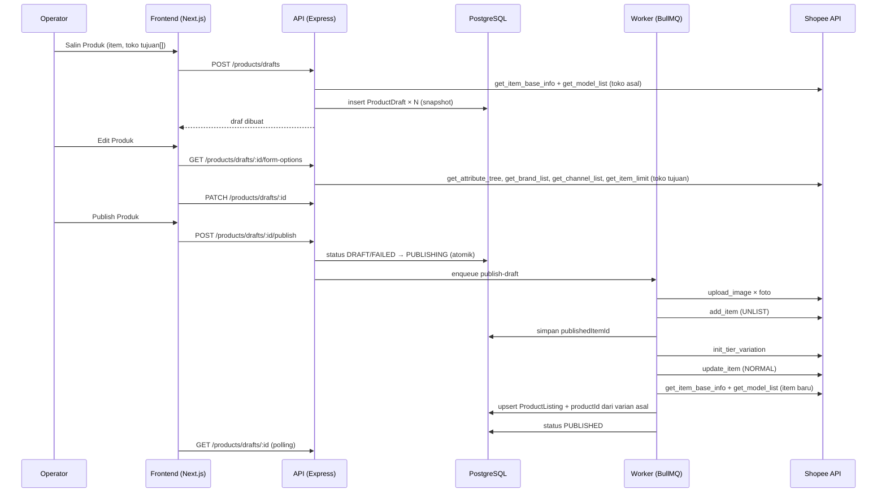
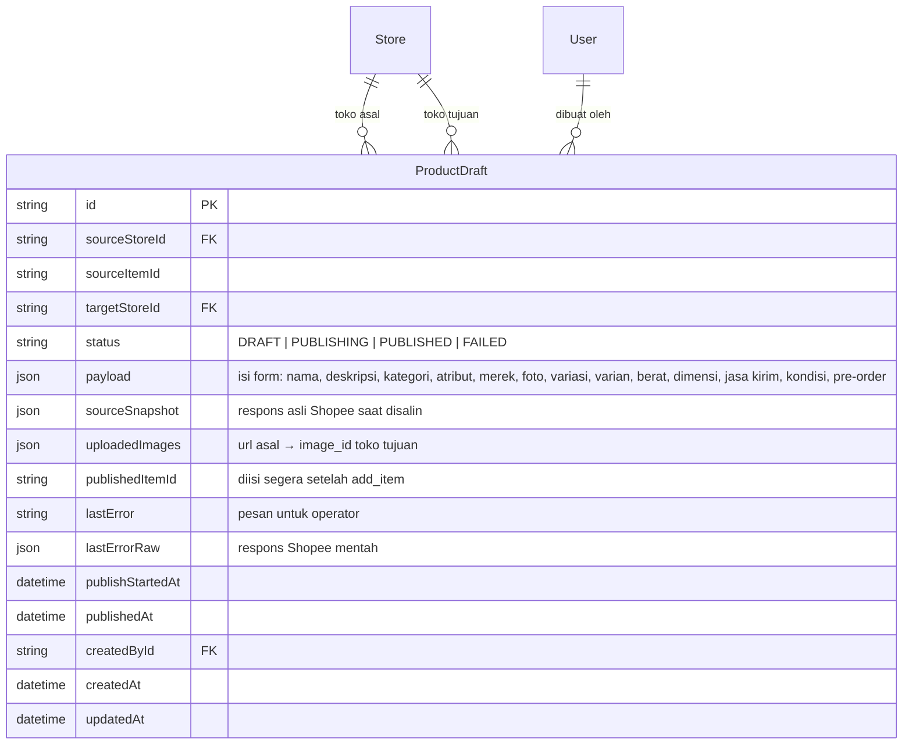

# PRD — Salin Produk (Shopee → Shopee)

> Status: **draf, menunggu persetujuan** · 17 Sep 2026
> Patokan: dokumen operator "Master Produk" (Google Doc, tab Master Produk) dan screenshot Komplace.

## 1. Overview

Operator sering memasang produk yang sama di beberapa toko Shopee, misalnya Zora Cap dari Zaneva Official Shop ke Zaneva Curve Active. Di Komplace caranya: **Salin Produk**, pilih toko tujuan, hasilnya jadi **Draf**, draf dirapikan (terutama nama, karena tidak boleh sama persis), lalu **Publish**. OrderPro belum punya fitur ini, jadi operator masih harus kembali ke Komplace.

Fitur ini meniru alur tersebut untuk **Shopee ke Shopee saja**. TikTok, Tokopedia, Lazada, dan Toco di luar ruang lingkup.

---

## 2. Requirements

- **Aksesibilitas:** Web (desktop, tetap bisa dipakai di HP), di dalam OrderPro yang sudah ada
- **Pengguna:** operator. **Semua role** boleh menyalin, mengedit draf, dan Publish. STAFF dibatasi ke toko yang dia punya akses, **baik toko asal maupun toko tujuan**
- **Auth:** JWT yang sudah ada (`requireAuth`, `StoreAccess`)
- **Data input:** snapshot dari Shopee API (`get_item_base_info`, `get_model_list`), lalu diedit manual di form draf
- **Export:** tidak ada
- **Constraint khusus:**
  - **Izin API tulis belum terverifikasi.** Implementasi baru dimulai setelah `scripts/probe-product-write.js` menunjukkan `add_item` dan `upload_image` diizinkan (lihat §8)
  - Hanya toko Shopee yang aktif dan tidak `needsReconnect`
  - Satu produk per sekali salin, bisa ke **beberapa toko tujuan** (satu draf per toko)

---

## 3. Core Features

### 3.1 Salin Produk — Must-have
- Pemicunya di halaman **Produk**: pilih baris dari **satu produk** (satu `itemId` di satu toko), lalu tombol **Salin Produk** muncul di bar pilihan, di sebelah "Jadikan Master". Kalau baris yang dipilih berasal dari lebih dari satu produk, tombolnya nonaktif dengan keterangan
- Dialog **"Pilih Toko tujuan untuk Salin Produk"**:
  - Marketplace: hanya Shopee (tetap ditampilkan sebagai kartu terpilih supaya mirip Komplace)
  - Checkbox semua toko Shopee yang boleh diakses user, **kecuali toko asal**
  - Penghitung "N Toko Terpilih", tombol Batal dan Salin Produk
- Saat Salin Produk ditekan, backend mengambil data **terbaru** produk asal dari Shopee (bukan dari cache katalog) dan membuat **satu draf per toko tujuan**
- Kalau draf yang belum dipublish untuk produk yang sama di toko yang sama sudah ada, muncul peringatan "sudah ada draf" dengan link ke draf itu. Draf baru tetap boleh dibuat

### 3.2 Halaman Draf — Must-have
- Halaman `/products/drafts`, dengan link "Draf (N)" dari halaman Produk
- Kolom: foto, nama, toko tujuan, asal (toko + nama produk asal), jumlah varian, harga (rentang), stok total, status, terakhir diubah
- Filter: toko tujuan, status (Draf / Sedang Publish / Gagal / Terbit), cari nama
- Menu **Atur** per baris: Edit Produk, Publish Produk, Hapus Draf
- Draf yang gagal menampilkan banner merah "Produk tidak diterbitkan" dan tombol **Lihat Error**

### 3.3 Edit Produk (form draf) — Must-have
Semua field sudah terisi dari produk asal:

| Bagian | Field | Bisa diubah |
|---|---|---|
| Informasi Dasar | Toko tujuan | Tidak |
| | Nama produk (penghitung karakter sesuai batas Shopee) | Ya |
| | Deskripsi (penghitung karakter) | Ya |
| | Kategori | **Tidak** di versi pertama. Salin antar toko Shopee kategorinya sama |
| Atribut Produk | Merek, dan semua atribut dari `get_attribute_tree` (wajib ditandai) | Ya |
| Gambar | Foto produk (urutan, hapus) | Ya: urutan dan hapus. Tambah foto baru = nice-to-have |
| Informasi Penjualan | Nama variasi (mis. "Warna"), pilihan (Red/White/…) | Ya: ganti nama, hapus pilihan. Tambah pilihan = nice-to-have |
| | Per varian: Harga, Stok, SKU | Ya |
| Pengiriman | Berat, dimensi (P×L×T) | Ya |
| | Jasa kirim: daftar channel yang aktif di **toko tujuan** | Ya, centang/hilangkan |
| Lainnya | Kondisi (Baru/Bekas), Pre-order + hari kirim | Ya |

- Tombol **Simpan Draf** dan **Publish Produk**
- Validasi di form sebelum Publish: nama wajib diisi dan **tidak boleh sama persis dengan nama produk asal**, panjang nama/deskripsi dan jumlah foto sesuai `get_item_limit`, atribut wajib terisi, minimal satu jasa kirim, harga > 0, stok ≥ 0

### 3.4 Publish ke Shopee — Must-have
- Berjalan sebagai **job di worker** (BullMQ), bukan di request HTTP, karena bisa makan puluhan detik (unggah foto satu per satu). Status draf berubah ke *Sedang Publish* dan halaman memantaunya
- Urutan langkah:
  1. Unduh foto dari URL produk asal, lalu unggah ke `media_space/upload_image` untuk mendapat `image_id`. Foto varian juga
  2. `add_item` dengan status **UNLIST**
  3. Kalau ada variasi: `init_tier_variation` (nama variasi, pilihan, harga/stok/SKU per varian)
  4. Setelah semua berhasil: ubah status item ke **NORMAL**, sehingga produk tayang
  5. Tarik item baru ke `ProductListing` (pakai logika katalog yang sudah ada), lalu **ikat otomatis** tiap varian ke Master SKU varian asal yang sepadan (§3.5)
  6. Draf ditandai *Terbit* dan menyimpan `itemId` barunya
- **Kenapa dibuat UNLIST dulu:** kalau langkah 3 gagal, item setengah jadi (tanpa variasi, harga/stok salah) tidak sempat tayang dan dibeli orang. Bagi operator hasil akhirnya tetap "langsung tayang"
- **Aman diulang:** `itemId` disimpan segera setelah langkah 2 berhasil. Publish ulang draf yang gagal melanjutkan item itu, **bukan membuat item baru**, jadi tidak ada produk dobel di Shopee
- Error dari Shopee disimpan mentah (untuk developer), plus kalimat bahasa Indonesia untuk operator ("Lihat Error")

### 3.5 Ikat otomatis ke Master SKU — Must-have
- Varian baru dicocokkan ke varian asal lewat **posisi pilihan variasi** (`tier_index`), bukan lewat SKU, karena SKU boleh diubah di draf
- Kalau listing varian asal punya `productId`, listing baru diberi `productId` yang sama
- Kalau varian asal belum terikat ke master, varian baru juga tidak diikat (tanpa error)
- Kalau operator menghapus pilihan variasi di draf, varian itu tidak ada, jadi tidak ada yang diikat

### 3.6 Nice-to-have (tidak di versi pertama)
- Salin banyak produk sekaligus
- Tambah foto baru, tambah pilihan variasi baru
- Ubah kategori (butuh pemetaan ulang atribut)
- Salin video produk dan size chart
- Salin ke TikTok / marketplace lain

---

## 4. User Flow

### Salin → Edit → Publish
1. Operator buka **Produk**, filter toko Zaneva Official Shop, cari "zora", lalu centang varian-varian Zora Cap
2. Klik **Salin Produk**, centang **Zaneva Curve Active**, klik **Salin Produk**
3. Toast "1 draf dibuat", dengan link ke halaman Draf
4. Di **Draf**, pilih Atur → **Edit Produk**. Form sudah terisi. Operator mengubah nama (misalnya menambah "Curve"), mengecek jasa kirim, lalu **Simpan Draf**
5. Klik **Publish Produk**. Status berubah jadi *Sedang Publish*, lalu *Terbit*
6. Produk muncul di halaman Produk untuk toko Zaneva Curve Active, kolom Master sudah terisi, dan stoknya ikut Daftar Stok

### Edge Cases
- **Tidak ada toko tujuan** (user hanya punya akses satu toko): dialog menampilkan "Tidak ada toko tujuan yang bisa kamu akses"
- **Toko tujuan perlu dihubungkan ulang** (`needsReconnect`): toko ditampilkan nonaktif di dialog. Kalau terjadi saat Publish, draf *Gagal* dengan pesan "Hubungkan ulang toko di Kelola Toko"
- **Produk asal sudah dihapus/diblokir di Shopee** saat disalin: gagal membuat draf, dengan pesan jelas. Setelah draf ada, draf memakai snapshot dan tidak terpengaruh
- **Foto gagal diunduh/diunggah**: draf *Gagal*, error menyebut foto ke berapa. Foto yang sudah terunggah tidak diulang
- **Nama sama persis dengan produk asal**: Publish diblokir di form
- **Atribut wajib kosong** (kategori di toko tujuan mewajibkan atribut yang di asal kosong): Publish diblokir, field ditandai
- **Jasa kirim asal tidak aktif di toko tujuan**: channel itu tidak dicentang dan ada keterangan
- **Gagal setelah `add_item`**: item tetap UNLIST di Shopee, draf *Gagal*. Publish ulang melanjutkan item yang sama. Tombol Hapus Draf memperingatkan bahwa item UNLIST itu masih ada di Seller Centre
- **Worker mati di tengah Publish**: job diulang BullMQ. Draf yang *Sedang Publish* lebih dari 15 menit dianggap *Gagal* dan bisa di-Publish ulang
- **Dua orang menekan Publish bersamaan**: hanya satu job. Transisi DRAFT/FAILED → PUBLISHING dilakukan atomik
- **Draf sudah Terbit**: tidak bisa diedit atau di-Publish lagi, hanya bisa dilihat

---

## 5. Architecture

---

## 6. Database Schema

Satu tabel baru, dan migrasinya hanya menambah (tabel lama tidak diubah).

| Tabel | Fungsi |
|-------|--------|
| `product_drafts` | Draf salinan produk per toko tujuan, dari dibuat sampai terbit |
| `product_listings` (sudah ada) | Diisi untuk item baru setelah terbit, termasuk `productId` hasil ikat otomatis |

Index: `(targetStoreId, status)`, `(sourceStoreId, sourceItemId)`.

`uploadedImages` dipisah dari `payload` supaya Publish ulang tidak mengunggah foto yang sama lagi.

---

## 7. Design & Technical Constraints

### Tech Stack (ikut OrderPro, bukan stack app baru)
- **Frontend:** Next.js (static export) di `frontend/`, Tailwind, lucide-react, ikut komponen dan pola halaman `products` / `stock`
- **Backend:** Express (JavaScript), route baru di `src/routes/productDrafts.js`, logika Publish di `src/services/productCopy.js`
- **ORM / DB:** Prisma 6 + PostgreSQL
- **Queue:** BullMQ + Redis (worker yang sudah ada)
- **Auth:** JWT + `StoreAccess` yang sudah ada
- **Deploy:** EasyPanel (container api + worker)

### UI
- Ikut design system OrderPro yang sudah ada: light/dark, kelas `card`, `btn-primary`, `input`
- Label Bahasa Indonesia. Istilah baku tetap: Draf, Publish, SKU, Master SKU

### Naming Convention
- Kode: bahasa Inggris, camelCase
- Route: `/api/products/drafts`, `/api/products/drafts/:id`, `/api/products/drafts/:id/publish`, `/api/products/drafts/:id/form-options`
- Status: `DRAFT`, `PUBLISHING`, `PUBLISHED`, `FAILED`

### Business Logic Hardcoded (tidak diubah tanpa konfirmasi Rizky)
1. Shopee → Shopee saja
2. Satu produk per sekali salin, satu draf per toko tujuan, toko asal tidak bisa jadi tujuan
3. Publish = langsung tayang (secara teknis dibuat UNLIST lalu dijadikan NORMAL di langkah terakhir)
4. Varian hasil Publish otomatis terikat ke Master SKU varian asal (dicocokkan lewat posisi variasi)
5. Nama produk tidak boleh sama persis dengan nama produk asal
6. Harga, stok, dan SKU awal disalin dari produk asal. Stok **tidak** mengurangi atau membagi stok toko asal
7. Semua role boleh menyalin dan Publish, STAFF hanya untuk toko yang dia punya akses (asal dan tujuan)

### Constraint Lain
- Panggilan ke Shopee lewat `ShopeeService._request` (retry + backoff yang sudah ada). Unggah foto dibatasi concurrency kecil (2–3)
- `sourceSnapshot` menyimpan data mentah supaya bug pemetaan field bisa ditelusuri tanpa menyalin ulang
- Test unit (`node --test`) untuk: pemetaan snapshot → payload, payload → body `add_item`/`init_tier_variation`, pencocokan varian ke master, validasi form, transisi status

---

## 8. Yang harus dipastikan sebelum mulai coding

Belum pernah dicek, dan hasilnya bisa mengubah rencana di atas:

| # | Pertanyaan | Cara cek | Kalau hasilnya buruk |
|---|---|---|---|
| 1 | Apakah app boleh memanggil `add_item` / `init_tier_variation`? | `node scripts/probe-product-write.js` di container api | Ajukan izin Product (tulis) di Shopee Open Platform, lalu semua toko diotorisasi ulang. Fitur menunggu |
| 2 | Apakah app boleh `media_space/upload_image`? | Skrip yang sama | Ajukan izin Media Space |
| 3 | Apakah `get_item_base_info` mengembalikan deskripsi, atribut, merek, berat, dimensi, dan jasa kirim? | Skrip yang sama, bagian 2 | Field yang tidak ada harus diisi manual di draf |
| 4 | Apakah deskripsi toko asal memakai *extended description* (deskripsi bergambar)? | Skrip yang sama (`description_type`) | Versi pertama hanya menyalin teksnya, foto di deskripsi tidak ikut |
| 5 | Apakah `add_item` menerima `item_status: UNLIST`? | Baru terlihat saat implementasi (dites ke toko uji) | Tanpa UNLIST, item langsung tayang sejak langkah 2, jadi risiko item setengah jadi harus diterima atau dicegah dengan cara lain |

Setelah poin 1–3 aman, saya butuh **satu toko yang boleh dipakai uji Publish sungguhan**. Produk uji akan tayang di Shopee lalu dihapus.
