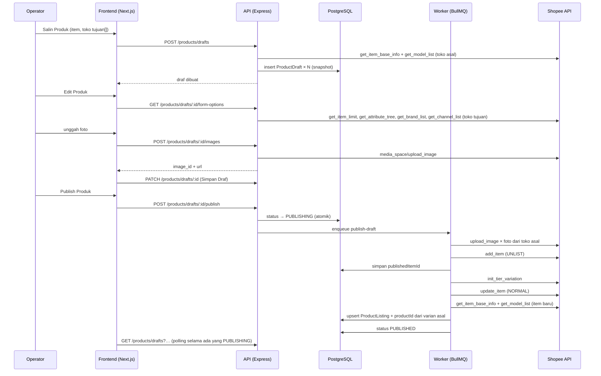
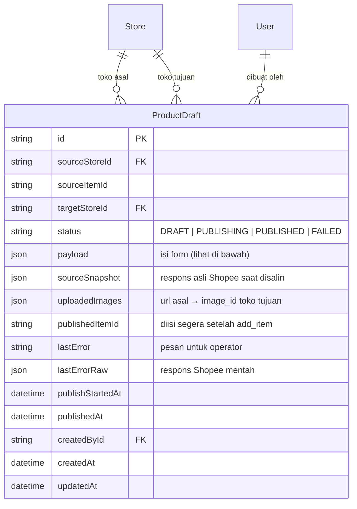

# PRD — Salin Produk (Shopee → Shopee)

> Status: **draf, menunggu persetujuan** · 17 Sep 2026 (revisi 2: disesuaikan dengan screenshot form Edit Produk Komplace)
> Patokan: dokumen operator "Master Produk" (Google Doc) dan screenshot Komplace.

## 1. Overview

Operator sering memasang produk yang sama di beberapa toko Shopee, misalnya Zora Cap dari Zaneva Official Shop ke Zaneva Curve Active. Di Komplace caranya: **Salin Produk**, pilih toko tujuan, hasilnya muncul di tab **Draf** toko tujuan, draf dirapikan lewat **Edit Produk** (terutama nama, karena tidak boleh sama persis), lalu **Publish Produk**. OrderPro belum punya fitur ini, jadi operator masih harus kembali ke Komplace.

Fitur ini meniru alur tersebut untuk **Shopee ke Shopee saja**. TikTok, Tokopedia, Lazada, dan Toco di luar ruang lingkup.

---

## 2. Requirements

- **Aksesibilitas:** Web (desktop, tetap bisa dipakai di HP), di dalam OrderPro yang sudah ada
- **Pengguna:** operator. **Semua role** boleh menyalin, mengedit draf, dan Publish. STAFF dibatasi ke toko yang dia punya akses, **baik toko asal maupun toko tujuan**
- **Auth:** JWT yang sudah ada (`requireAuth`, `StoreAccess`)
- **Data input:** snapshot dari Shopee API (`get_item_base_info`, `get_model_list`), diedit manual di form draf, plus foto yang diunggah operator
- **Export:** tidak ada
- **Constraint khusus:**
  - **Izin API tulis belum terverifikasi.** Implementasi baru dimulai setelah `scripts/probe-product-write.js` menunjukkan `add_item` dan `upload_image` diizinkan (lihat §8)
  - Hanya toko Shopee yang aktif dan tidak `needsReconnect`
  - Satu produk per sekali salin, bisa ke **beberapa toko tujuan** (satu draf per toko)

---

## 3. Core Features

### 3.1 Salin Produk — Must-have
- Pemicunya di halaman **Produk**: pilih baris dari **satu produk** (satu `itemId` di satu toko), lalu tombol **Salin Produk** muncul di bar pilihan, di sebelah "Jadikan Master". Kalau baris yang dipilih berasal dari lebih dari satu produk, tombolnya nonaktif dengan keterangan
- Dialog **"Pilih Toko tujuan untuk Salin Produk"**:
  - Pilih Marketplace: hanya kartu Shopee (terpilih). Marketplace lain tidak ditampilkan
  - Pilih Toko: checkbox semua toko Shopee yang boleh diakses user, **kecuali toko asal**, dalam 3 kolom
  - Penghitung "N Toko Terpilih", tombol Batal dan Salin Produk
- Saat Salin Produk ditekan, backend mengambil data **terbaru** produk asal dari Shopee (bukan dari cache katalog) dan membuat **satu draf per toko tujuan**
- Kalau draf yang belum dipublish untuk produk yang sama di toko yang sama sudah ada, muncul peringatan "sudah ada draf" dengan link ke draf itu. Draf baru tetap boleh dibuat

### 3.2 Tab Draf di halaman Produk — Must-have
Seperti Komplace, Draf adalah **tab di halaman Produk**, bukan halaman terpisah.
- Tab: **Aktif** (daftar listing yang sekarang) | **Draf (N)**. Filter toko dan kotak cari berlaku untuk kedua tab
- Satu baris per draf: foto, nama, badge toko tujuan, SKU induk, Master SKU (`-` sampai terbit), harga (rentang kalau beda per varian), stok total
- **Lihat Varian Produk**: baris dilipat yang berisi daftar varian (nama, harga, stok, SKU)
- Status tampil sebagai badge: Draf / Sedang Publish / Gagal / Terbit
- Menu **Atur** per baris: **Publish Produk**, **Edit Produk**, **Hapus Draf**
- Draf yang gagal menampilkan banner merah di bawah barisnya: "Produk tidak diterbitkan: <pesan singkat>" + **Lihat Error** (membuka pesan lengkap dan respons Shopee mentah, dengan tombol Salin untuk dikirim ke developer)

Menu Komplace yang **sengaja tidak dibuat**:

| Menu Komplace | Kenapa tidak perlu |
|---|---|
| Reupload Gambar | OrderPro mengunggah foto ke toko tujuan otomatis saat Publish, dan foto yang sudah terunggah tidak diulang |
| Isi Kategori Otomatis | Hanya perlu saat pindah marketplace. Antar toko Shopee kategorinya sama |
| Tambah Tag Supplier | Fitur khusus Komplace, tidak ada padanannya di OrderPro |
| Salin Produk (dari draf) | Nice-to-have (§3.7) |

### 3.3 Edit Produk (form draf) — Must-have
Urutan bagian dan isinya mengikuti form Komplace. Semua field sudah terisi dari produk asal. Batas karakter dan jumlah diambil dari `get_item_limit` toko tujuan (di screenshot: nama 255, deskripsi 5000, nama variasi 14, pilihan 20).

**Informasi Dasar**
- Toko: tujuan, tidak bisa diubah
- Nama Produk, dengan penghitung `121/255`
- Deskripsi, dengan penghitung `2679/5000`
- Kategori: ditampilkan sebagai jalur ("Olahraga & Outdoor > Aksesoris … > Topi …"). **Tidak bisa diubah di versi pertama** (§3.7)

**Atribut Produk**
- Atribut **wajib** selalu tampil (di contoh: Merk, Jenis Kelamin, Asal Produk)
- Atribut lain dilipat di bawah tombol **Atribut Lainnya**
- Pilihan diambil dari `get_attribute_tree` dan `get_brand_list` toko tujuan, dengan dropdown yang bisa dicari

**Informasi Penjualan**
- **Variasi 1** dan **Variasi 2** (kalau ada): nama variasi dan daftar pilihan, masing-masing dengan penghitung karakter
  - Ganti nama pilihan, hapus pilihan (ikon tong sampah), **Tambah Pilihan**, hapus seluruh variasi (×)
  - Kalau bentuk variasi berubah, tabel varian di bawah menyesuaikan. Varian lama yang masih ada tetap menyimpan harga/stok/SKU-nya
- **Terapkan ke semua**: isi Harga, Stok, dan/atau SKU sekali lalu tekan **Terapkan ke Semua** untuk mengisi semua varian. Kolom yang dibiarkan kosong tidak mengubah apa-apa
- **Tabel varian**: satu baris per kombinasi, kolom Harga (Rp), Stok (pcs), SKU. Bisa digeser ke samping di layar sempit
- **Berat dan ukuran berbeda tiap varian**: toggle. Kalau aktif, tabel mendapat kolom berat dan ukuran per varian. *Tergantung dukungan API, lihat §8*

**Media**
- **Foto Produk**: maksimal 9 (Foto Utama + Foto 1–8). Urutan bisa diubah dengan drag and drop. Menu ⋮ per foto: Jadikan Foto Utama, Ganti, Hapus. Slot kosong untuk **unggah foto baru**
- **Foto Variasi**: satu foto per pilihan Variasi 1, bisa diganti. Pilihan baru dari Tambah Pilihan wajib diberi foto kalau pilihan lain punya foto (aturan Shopee)
- **Bagan Ukuran**: disalin dari produk asal kalau ada. Bisa diunggah atau diganti (JPG/PNG). **Wajib** kalau kategori toko tujuan mewajibkannya, dan tanda * mengikuti kategori
- **Video Produk**: tidak disalin di versi pertama. Draf Komplace di screenshot juga kosong (§3.7)

**Informasi Pengiriman**
- Berat (gr), Ukuran Paket P × L × T (cm)
- **Jasa Kirim**: daftar channel yang **aktif di toko tujuan** (`get_channel_list`), dikelompokkan seperti di Shopee (Hemat Kargo, Instant, Reguler (Cashless), Instant Prioritas, …). Grup bisa dibuka untuk melihat kurir di dalamnya, dan tiap grup punya checkbox. Batas berat channel ditampilkan ("maks 21.000g"). Channel yang tidak sanggup membawa berat produk otomatis nonaktif
- Channel yang aktif di produk asal dan juga aktif di toko tujuan sudah dicentang

**Tombol** (bawah form): **Batal** · **Simpan Draf** (padanan "Update Produk" Komplace) · **Publish Produk**

**Validasi sebelum Publish** (field yang salah ditandai dan halaman menggulir ke sana):
- Nama wajib diisi dan **tidak boleh sama persis dengan nama produk asal**
- Panjang nama, deskripsi, nama variasi, dan pilihan sesuai batas
- Minimal 1 foto produk, maksimal 9. Foto variasi lengkap kalau dipakai
- Atribut wajib dan bagan ukuran (kalau wajib) terisi
- Setiap varian: harga > 0, stok ≥ 0. Tidak ada pilihan variasi yang namanya kembar
- Minimal satu jasa kirim, dan berat tidak melebihi batas channel yang dicentang

### 3.4 Unggah foto — Must-have
- Foto yang diunggah operator (foto produk, foto variasi, bagan ukuran) **langsung dikirim ke Shopee** (`media_space/upload_image`). Yang disimpan di draf hanya `image_id` dan URL-nya, jadi OrderPro tidak perlu menyimpan file
- Batas ukuran dan format mengikuti Shopee. Kalau Shopee menolak, pesannya ditampilkan di slot foto itu

### 3.5 Publish ke Shopee — Must-have
- Berjalan sebagai **job di worker** (BullMQ), bukan di request HTTP, karena bisa makan puluhan detik (unggah foto satu per satu). Status draf berubah ke *Sedang Publish* dan tab Draf memantaunya
- Urutan langkah:
  1. Foto yang masih berasal dari toko asal diunduh lalu diunggah ke `media_space/upload_image` untuk mendapat `image_id`. Ini berlaku untuk foto produk, foto variasi, dan bagan ukuran. Foto yang sudah punya `image_id` dilewati
  2. `add_item` dengan status **UNLIST**
  3. Kalau ada variasi: `init_tier_variation` (variasi, pilihan, foto variasi, harga/stok/SKU per varian)
  4. Setelah semua berhasil: ubah status item ke **NORMAL**, sehingga produk tayang
  5. Tarik item baru ke `ProductListing` (pakai logika katalog yang sudah ada), lalu **ikat otomatis** tiap varian ke Master SKU varian asal (§3.6)
  6. Draf ditandai *Terbit* dan menyimpan `itemId` barunya
- **Kenapa dibuat UNLIST dulu:** kalau langkah 3 gagal, item setengah jadi (tanpa variasi, harga/stok salah) tidak sempat tayang dan dibeli orang. Bagi operator hasil akhirnya tetap "langsung tayang"
- **Aman diulang:** `itemId` disimpan segera setelah langkah 2 berhasil. Publish ulang draf yang gagal melanjutkan item itu, **bukan membuat item baru**, jadi tidak ada produk dobel di Shopee
- Error dari Shopee disimpan mentah (untuk developer), plus kalimat bahasa Indonesia untuk operator. Error yang tidak dikenali tetap ditampilkan apa adanya, tidak disembunyikan di balik "error tidak diketahui"

### 3.6 Ikat otomatis ke Master SKU — Must-have
- Varian baru dicocokkan ke varian asal lewat **nama pilihan variasi aslinya** (dicatat saat draf dibuat, jadi tetap cocok walau operator mengganti nama pilihan atau SKU)
- Kalau listing varian asal punya `productId`, listing baru diberi `productId` yang sama
- Kalau varian asal belum terikat ke master, varian baru juga tidak diikat (tanpa error)
- Pilihan yang ditambahkan di draf tidak punya asal, jadi tidak diikat. Operator mengikatnya sendiri

### 3.7 Nice-to-have (tidak di versi pertama)
- Salin banyak produk sekaligus
- Ubah Kategori (butuh pemetaan ulang atribut)
- Salin dan unggah video produk
- Salin Produk dari draf
- Salin ke TikTok / marketplace lain

---

## 4. User Flow

### Salin → Edit → Publish (contoh dari dokumen operator)
1. Operator buka **Produk**, pilih toko Zaneva Official Shop, cari "zora", lalu centang varian-varian Zora Cap
2. Klik **Salin Produk**, centang **Zaneva Curve Active**, klik **Salin Produk**
3. Toast "1 draf dibuat di Zaneva Curve Active", dengan link ke tab Draf
4. Pilih toko Zaneva Curve Active, tab **Draf**. Zora Cap ada di sana, Master SKU `-`, harga Rp 122.000, stok 3904 (jumlah stok semua varian)
5. Atur → **Edit Produk**. Form sudah terisi: deskripsi, Merk Zaneva, Jenis Kelamin Unisex, Asal Produk Indonesia, variasi Warna (Red/White/Beige/Indigo/Black), harga/stok/SKU per varian, 9 foto, 5 foto variasi, berat 60 gr, ukuran 20×15×5 cm, jasa kirim
6. Operator mengubah nama supaya tidak sama persis, lalu **Simpan Draf**
7. **Publish Produk**. Status berubah jadi *Sedang Publish*, lalu *Terbit*
8. Di tab Aktif, Zora Cap muncul untuk Zaneva Curve Active, kolom Master sudah terisi, dan stoknya ikut Daftar Stok

### Edge Cases
- **Tidak ada toko tujuan** (user hanya punya akses satu toko): dialog menampilkan "Tidak ada toko tujuan yang bisa kamu akses"
- **Toko tujuan perlu dihubungkan ulang** (`needsReconnect`): toko nonaktif di dialog. Kalau terjadi saat Publish, draf *Gagal* dengan pesan "Hubungkan ulang toko di Kelola Toko"
- **Produk asal sudah dihapus/diblokir di Shopee** saat disalin: gagal membuat draf, dengan pesan jelas. Setelah draf ada, draf memakai snapshot dan tidak terpengaruh
- **Foto gagal diunduh/diunggah**: draf *Gagal*, error menyebut foto yang mana. Foto yang sudah terunggah tidak diulang
- **Nama sama persis dengan produk asal**: Publish diblokir di form
- **Atribut atau bagan ukuran wajib kosong**: Publish diblokir, field ditandai
- **Jasa kirim asal tidak aktif di toko tujuan**: channel itu tidak muncul, dan ada catatan "N jasa kirim dari produk asal tidak aktif di toko ini"
- **Gagal setelah `add_item`**: item tetap UNLIST di Shopee, draf *Gagal*. Publish ulang melanjutkan item yang sama. Hapus Draf memperingatkan bahwa item UNLIST itu masih ada di Seller Centre
- **Worker mati di tengah Publish**: job diulang BullMQ. Draf yang *Sedang Publish* lebih dari 15 menit dianggap *Gagal* dan bisa di-Publish ulang
- **Dua orang menekan Publish bersamaan**: hanya satu job. Transisi Draf/Gagal → Sedang Publish dilakukan atomik
- **Draf sedang dipublish atau sudah Terbit**: form hanya bisa dilihat, tidak bisa disimpan
- **Operator menutup form dengan perubahan belum disimpan**: konfirmasi "Buang perubahan?"

---

## 5. Architecture

---

## 6. Database Schema

Satu tabel baru, dan migrasinya hanya menambah (tabel lama tidak diubah).

Isi `payload`: `name`, `description`, `categoryId`, `categoryPath`, `brand {id, name}`, `attributes[]`, `images[] {imageId?, url}`, `sizeChart {imageId?, url}?`, `tiers[] {name, options[] {name, sourceName?, image?}}`, `models[] {tierIndex[], sourceModelId?, price, stock, sku, weight?, dimension?}`, `weight`, `dimension {length, width, height}`, `perModelShipping` (boolean), `logistics[] {channelId, enabled}`, `condition`, `preOrder {enabled, daysToShip}`.

| Tabel | Fungsi |
|-------|--------|
| `product_drafts` | Draf salinan produk per toko tujuan, dari dibuat sampai terbit |
| `product_listings` (sudah ada) | Diisi untuk item baru setelah terbit, termasuk `productId` hasil ikat otomatis |

Index: `(targetStoreId, status)`, `(sourceStoreId, sourceItemId)`.

`uploadedImages` dipisah dari `payload` supaya Publish ulang tidak mengunggah foto yang sama lagi.

---

## 7. Design & Technical Constraints

### Tech Stack (ikut OrderPro, bukan stack app baru)
- **Frontend:** Next.js (static export) di `frontend/`, Tailwind, lucide-react, ikut komponen dan pola halaman `products` / `stock`. Form Edit Produk jadi halaman sendiri (`/products/drafts/edit?id=…`) karena terlalu panjang untuk modal
- **Backend:** Express (JavaScript), route baru di `src/routes/productDrafts.js`, logika salin/Publish di `src/services/productCopy.js`, unggah foto lewat `multer` (sudah jadi dependency) langsung diteruskan ke Shopee
- **ORM / DB:** Prisma 6 + PostgreSQL
- **Queue:** BullMQ + Redis (worker yang sudah ada)
- **Auth:** JWT + `StoreAccess` yang sudah ada
- **Deploy:** EasyPanel (container api + worker)

### UI
- Ikut design system OrderPro yang sudah ada: light/dark, kelas `card`, `btn-primary`, `input`
- Label Bahasa Indonesia. Istilah baku tetap: Draf, Publish, SKU, Master SKU

### Naming Convention
- Kode: bahasa Inggris, camelCase
- Route: `GET/POST /api/products/drafts`, `GET/PATCH/DELETE /api/products/drafts/:id`, `GET /api/products/drafts/:id/form-options`, `POST /api/products/drafts/:id/images`, `POST /api/products/drafts/:id/publish`
- Status: `DRAFT`, `PUBLISHING`, `PUBLISHED`, `FAILED`

### Business Logic Hardcoded (tidak diubah tanpa konfirmasi Rizky)
1. Shopee → Shopee saja
2. Satu produk per sekali salin, satu draf per toko tujuan, toko asal tidak bisa jadi tujuan
3. Publish = langsung tayang (secara teknis dibuat UNLIST lalu dijadikan NORMAL di langkah terakhir)
4. Varian hasil Publish otomatis terikat ke Master SKU varian asal
5. Nama produk tidak boleh sama persis dengan nama produk asal
6. Harga, stok, dan SKU awal disalin dari produk asal. Stok **tidak** mengurangi atau membagi stok toko asal
7. Semua role boleh menyalin dan Publish, STAFF hanya untuk toko yang dia punya akses (asal dan tujuan)

### Constraint Lain
- Panggilan ke Shopee lewat `ShopeeService._request` (retry + backoff yang sudah ada). Unggah foto dibatasi concurrency kecil (2–3)
- `sourceSnapshot` menyimpan data mentah supaya bug pemetaan field bisa ditelusuri tanpa menyalin ulang
- Test unit (`node --test`) untuk: snapshot → payload, payload → body `add_item`/`init_tier_variation`, perubahan variasi → tabel varian, pencocokan varian ke master, validasi form, transisi status

---

## 8. Yang harus dipastikan sebelum mulai coding

Belum pernah dicek, dan hasilnya bisa mengubah rencana di atas. Poin 1–7 dijawab `node scripts/probe-product-write.js` di container api:

| # | Pertanyaan | Kalau hasilnya buruk |
|---|---|---|
| 1 | Apakah app boleh memanggil `add_item` / `init_tier_variation`? | Ajukan izin Product (tulis) di Shopee Open Platform, lalu semua toko diotorisasi ulang. Fitur menunggu |
| 2 | Apakah app boleh `media_space/upload_image`? | Ajukan izin Media Space |
| 3 | Apakah `get_item_base_info` mengembalikan deskripsi, atribut, merek, berat, dimensi, jasa kirim, dan bagan ukuran? | Field yang tidak ada harus diisi manual di draf |
| 4 | Apakah deskripsi toko asal memakai *extended description* (deskripsi bergambar)? | Versi pertama hanya menyalin teksnya, foto di deskripsi tidak ikut |
| 5 | Apakah varian punya berat/ukuran sendiri di `get_model_list`? | Toggle "Berbeda tiap varian" tidak dibuat, semua varian memakai berat produk |
| 6 | Bagaimana `get_channel_list` mengelompokkan jasa kirim (grup "Reguler (Cashless)" vs kurir di dalamnya), dan ID mana yang dikirim ke `add_item`? | Menentukan bentuk daftar Jasa Kirim di form |
| 7 | Apakah kategori contoh mewajibkan bagan ukuran (`support_size_chart`)? | Menentukan kapan tanda * muncul |
| 8 | Apakah `add_item` menerima `item_status: UNLIST`? Baru terlihat saat uji Publish ke toko uji | Tanpa UNLIST, item langsung tayang sejak langkah 2, jadi risiko item setengah jadi harus diterima atau dicegah dengan cara lain |

Setelah poin 1–3 aman, saya butuh **satu toko yang boleh dipakai uji Publish sungguhan**. Produk uji akan tayang di Shopee lalu dihapus.
